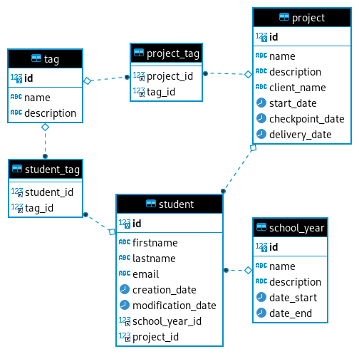

# MariaDB

## Les fichiers SQL

`src_mariadb.sql` est un export de la BDD qui contient la structure et les données.

`src_mariadb-structure-only.sql` est un export de la BDD qui contient uniquement la structure.

`src_mariadb-data-only.sql` est un export de la BDD qui contient uniquement les données.

Attention : ces fichiers SQL sont paramétrés pour remplacer les données (`DROP TABLE IF EXISTS` avant `CREATE TABLE`, `TRUNCATE` avant `INSERT`).
Si vous voulez conservez vos données, faites un backups avant d'importer ces fichiers SQL.

## Analyse

Voici le schéma de la BDD :

### Les tables

student :

- id : int, primary key, auto-increment
- firstname : varchar, 190
- lastname : varchar, 190
- email : varchar, 190
- created_at : datetime
- updated_at : datetime
- school_year_id : int, foreign key : school_year.id
- project_id : int, nullable, foreign key : project.id

school_year :

- id : int, primary key, auto-increment
- name : varchar, 190
- description : text, nullable
- start_date : date, nullable
- end_date : date, nullable

project :

- id : int, primary key, auto-increment
- name : varchar, 190
- description : text, nullable
- client_name : varchar, 190
- start_date : date, nullable
- checkpoint_date : date, nullable
- delivery_date : date, nullable

tag :

- id : int, primary key, auto-increment
- name : varchar, 190
- description : text

project_tag :

- project_id : int, index, constraint : project.id
- tag_id : int, index, constraint : tag.id

student_tag :

- student_id : int, index, constraint : student.id
- tag_id : int, index, constraint : tag.id

