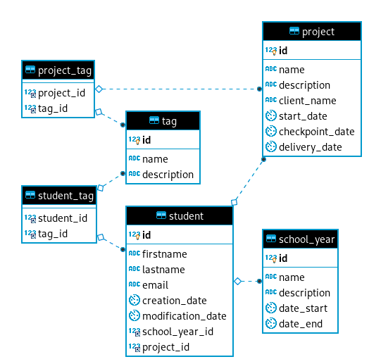

# MySQL

## Les fichiers SQL

`src_mysql.sql` est un export de la BDD qui contient la structure et les données.

`src_mysql-structure-only.sql` est un export de la BDD qui contient uniquement la structure.

`src_mysql-data-only.sql` est un export de la BDD qui contient uniquement les données.

Attention : ces fichiers SQL sont paramétrés pour remplacer les données (`DROP TABLE IF EXISTS` avant `CREATE TABLE`, `TRUNCATE` avant `INSERT`).
Si vous voulez conservez vos données, faites un backups avant d'importer ces fichiers SQL.

## Analyse

Voici le schéma de la BDD :

### Les tables

student :

- id : int, unsigned, primary key, auto-increment
- firstname : varchar, 255
- lastname : varchar, 255
- email : varchar, 255
- creation_date : timestamp, default value : current_timestamp
- modification_date : timestamp, default value : current_timestamp, on update : current_timestamp
- school_year_id : int, unsigned, nullable, foreign key : school_year.id
- project_id : int, unsigned, nullable, foreign key : project.id

school_year :

- id : int, unsigned, primary key, auto-increment
- name : varchar, 255
- description : text, nullable
- start_date : date, nullable
- start_end : date, nullable

project :

- id : int, unsigned, primary key, auto-increment
- name : varchar, 255
- description : text, nullable
- client_name : varchar, 255
- start_date : date, nullable
- checkpoint_date : date, nullable
- delivery_date : date, nullable

tag :

- id : int, unsigned, primary key, auto-increment
- name : varchar, 255
- description : text

project_tag :

- project_id : int, unsigned, index, constraint : project.id
- tag_id : int, unsigned, index, constraint : tag.id

student_tag :

- student_id : int, unsigned, index, constraint : student.id
- tag_id : int, unsigned, index, constraint : tag.id

## Requêtes SQL possibles

### Requêtes SQL simples

Listez :

- tous les students
- tous les projects
- le student dont l'id est `2`
- les students dont l'id n'est pas `2`
- le project dont l'id est `3`
- les projects dont l'id n'est pas `3`
- les students dont l'email contient la chaîne de caractères `.uk`
- les students dont la date de création est antérieure au 01/07/2018 exclus
- les projets dont le nom du client ne contient pas la chaîne de caractères `another`
- les projets dont la date de création est postérieure au 01/04/2018 inclus
- les students ayant un projet
- les students n'ayant pas de projet

### Requêtes SQL avec critères multiples

Listez :

- les students :
  - dont l'email contient la chaîne de caractères `.com`
  - OU dont la date de création est antérieure au 01/07/2018 exclus

- les students :
  - dont l'email contient la chaîne de caractères `.com`
  - ET dont la date de création est antérieure au 01/07/2018 exclus

- les students :
  - dont la date de création est postérieure au 01/01/2018 exclus
  - ET dont la date de création est antérieure au 01/07/2018 exclus

- les projets :
  - dont la description ne contient pas la chaîne de caractères `another`
  - OU dont la date de début est postérieure au 01/04/2018 inclus

- les projets :
  - dont la description ne contient pas la chaîne de caractères `another`
  - ET dont la date de début est postérieure au 01/04/2018 inclus

- les projets :
  - dont la date de création est postérieure au 01/01/2018 inclus
  - ET dont la date de début est antérieure au 01/03/2018 exclus

- les students :
  - dont l'email contient la chaîne de caractères `.com` ET la date de création est antérieure au 01/07/2018 exclus
  - OU ayant un projet

- les students :
  - dont l'email contient la chaîne de caractères `.com`ET la date de création est antérieure au 01/07/2018 exclus
  - ET n'ayant pas de projet

### Requêtes SQL avec jointure « many to one »

Listez :

- tous les students avec leurs projets
- le student dont l'id est `2` avec son projet

### Requêtes SQL avec jointure « one to many »

Listez :

- tous les projects avec leurs students
- le project dont l'id est `3` avec ses students

### Requêtes SQL avec jointure « many to many »

Listez :

- tous les students avec leurs tags
- tous les tags avec leurs students
- le student dont l'id est `2` avec ses tags
- le tag dont l'id est `2` avec ses students

